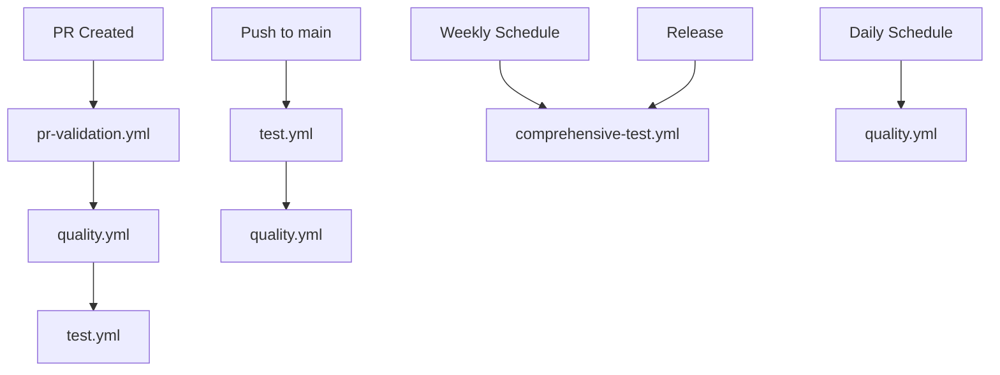

# GitHub Actions Workflows

This directory contains GitHub Actions workflows for the Logseq API MCP Server project.

## Workflows Overview

### 1. `test.yml` - Main Test Suite

**Triggers:** Push to main/develop, Pull Requests, Manual dispatch
**Purpose:** Core testing functionality

**Features:**

- Tests across Python 3.11, 3.12, and 3.13
- Linting with Ruff
- Type checking with MyPy
- Test coverage with pytest-cov
- MCP server startup testing
- Tool discovery validation
- Security scanning with Bandit
- Package build testing

### 2. `pr-validation.yml` - Pull Request Validation

**Triggers:** Pull Requests to main/develop
**Purpose:** Comprehensive PR validation

**Features:**

- Test coverage validation (80% minimum)
- Tool discovery verification
- MCP server startup testing
- Code quality checks
- Security scanning
- Test structure validation
- Individual tool suite testing
- Test artifact upload

### 3. `comprehensive-test.yml` - Comprehensive Testing

**Triggers:** Weekly schedule, Releases, Manual dispatch
**Purpose:** Extended testing and validation

**Features:**

- Multi-OS testing (Ubuntu, Windows, macOS)
- Performance testing
- Memory usage validation
- Integration testing
- MCP server with real tools
- Tool registration testing

### 4. `quality.yml` - Code Quality & Security

**Triggers:** Push to main/develop, Pull Requests, Daily schedule
**Purpose:** Code quality and security monitoring

**Features:**

- Ruff linting and formatting
- MyPy type checking
- Bandit security scanning
- TODO/FIXME comment detection
- Hardcoded secret detection
- Dependency vulnerability scanning
- License checking
- Coverage analysis

## Workflow Dependencies



## Test Coverage Requirements

- **Minimum Coverage:** 80% for PR validation
- **Target Coverage:** 85% for comprehensive testing
- **Coverage Tools:** pytest-cov with HTML and XML reports

## Security Checks

- **Bandit:** Python security linter
- **Safety:** Dependency vulnerability scanner
- **Secret Detection:** Hardcoded credential detection
- **License Check:** Dependency license validation

## Quality Gates

All workflows must pass for:

- ✅ Code to be merged to main
- ✅ Releases to be published
- ✅ PRs to be approved

## Artifacts Generated

- **Test Reports:** HTML coverage reports
- **Security Reports:** Bandit and Safety scan results
- **Dependency Reports:** License and vulnerability information
- **Performance Reports:** Test duration and memory usage

## Local Testing

To run the same checks locally:

```bash
# Install dependencies
uv sync --dev --group test

# Run tests with coverage
uv run pytest tests/ --cov=src/tools --cov-report=html

# Run linting
uv run ruff check src/ tests/
uv run ruff format --check src/ tests/

# Run type checking
uv run mypy src/ --ignore-missing-imports

# Run security scan
uv run bandit -r src/

# Run dependency check
uv run safety check
```

## Workflow Status Badges

Add these badges to your README:

```markdown


```

## Troubleshooting

### Common Issues

1. **Test Failures:** Check test logs for specific failures
2. **Coverage Issues:** Ensure all code paths are tested
3. **Linting Errors:** Run `uv run ruff check --fix` to auto-fix
4. **Security Issues:** Review Bandit reports for vulnerabilities
5. **Dependency Issues:** Check Safety reports for vulnerable packages

### Workflow Debugging

- Check workflow logs in GitHub Actions tab
- Download artifacts for detailed reports
- Run workflows locally using `act` tool
- Use `workflow_dispatch` for manual testing

## Contributing

When adding new tools or features:

1. Add corresponding tests to the test suite
2. Ensure test coverage remains above 80%
3. Update workflow configurations if needed
4. Test workflows locally before pushing
5. Monitor workflow status after changes
